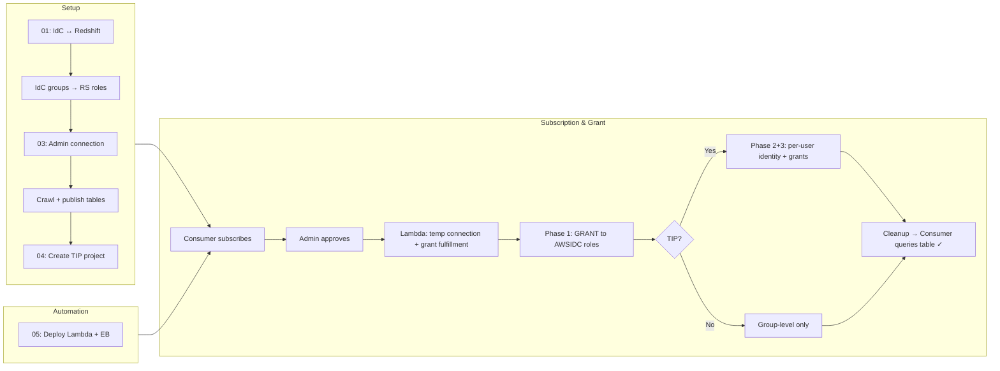
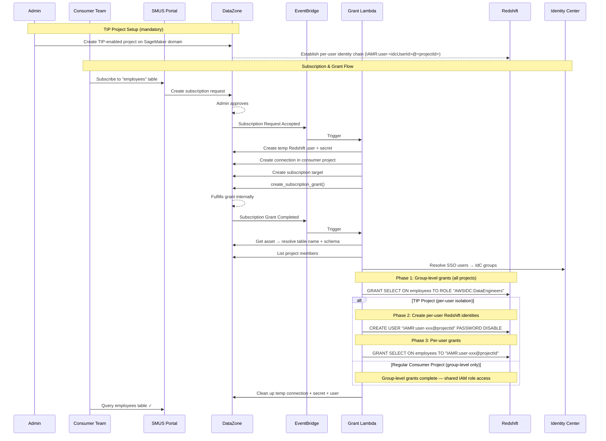

# SMUS Redshift Setup

## What This Does

This toolkit connects an existing Amazon Redshift cluster to SageMaker Unified Studio (SMUS) so that teams can discover, subscribe to, and query Redshift tables — all through the SMUS portal — without needing direct database credentials.

### The Problem

Out of the box, SMUS doesn't know your Redshift cluster exists. Even after you register it, there's no built-in way to automatically grant Redshift access when someone subscribes to a table through the data catalog. You'd have to manually run `GRANT` statements every time a new team wants access.

### The Solution

These scripts automate the entire pipeline:

1. **Identity setup** — Connect IAM Identity Center (IdC) to Redshift so users can log in with their SSO credentials instead of shared database passwords. IdC groups (e.g. `DataEngineers`, `DataAnalysts`) become Redshift roles.

2. **Publish tables** — Create a Redshift connection in the admin project, crawl the database, and publish each table as an asset in the DataZone catalog. Other teams can now browse and request access to these tables.

3. **TIP project creation (mandatory)** — Grants are provisioned through a Trusted Identity Propagation (TIP) project on the SageMaker domain. TIP project creation is a required step because it establishes the identity chain that allows Redshift to know exactly which user is querying. Without TIP, all users in a project share the same IAM role and see the same data. With TIP, each user gets their own Redshift identity (`IAMR:user-<idcUserId>@<projectId>`), enabling per-user table-level access control — user A can query `employees` but not `departments`, while user B gets the opposite, even though both are in the same project.

4. **Automated access grants** — A Lambda function listens for subscription events via EventBridge. When a team subscribes to a table and the request is approved, the Lambda automatically runs the Redshift `GRANT` statements — no manual intervention needed. The Lambda supports two levels of grants:
   - **Group-level grants** — Resolves project members' IdC groups and grants access to the corresponding `AWSIDC:<GroupName>` Redshift roles. This applies to all projects (TIP and non-TIP).
   - **TIP-level grants** — For TIP projects, additionally creates per-user Redshift identities and grants access to each individual user. This enables fine-grained, per-user isolation on top of group-level access.

   You can also use a regular (non-TIP) consumer project in the domain — the Lambda will still handle group-level grants automatically. However, TIP is the recommended approach because it provides per-user audit trails, fine-grained access control, and end-to-end identity propagation from the browser through to Redshift.

### End-to-End Flow



### Subscription Grant Detail



## Scripts

> Prefer the console instead? See [MANUAL-SETUP.md](MANUAL-SETUP.md) for a step-by-step guide using the AWS Console.

| # | Script | Purpose |
|---|--------|---------|
| 00 | `00-generate-env.sh` | Interactive (or piped) `.env` generator — auto-resolves from AWS APIs |
| 01 | `01-setup-idc-redshift.sh` | Set up IAM Identity Center integration with Redshift |
| 02 | `02-cleanup.sh` | Tear down existing admin project Redshift resources |
| 03 | `03-setup-admin-connection.sh` | Create secret, connection, data source, import tables, Glue DB |
| 04 | `04-setup-tip-project.sh` | Create TIP-enabled project with per-user Redshift table isolation |
| 05 | `05-deploy-grant-automation.sh` | Deploy Lambda + EventBridge for auto-granting Redshift access |
| 06 | `06-create-consumer-projects.sh` | Create consumer projects and configure environments |
| 07 | `07-subscribe-assets.sh` | Subscribe consumer project to published tables, approve, and verify grants |
| 08 | `08-teardown-grant-automation.sh` | Remove Lambda, EventBridge rule, and IAM role |

## Files

```
smus-redshift-asset-provision-setup/
├── .env                          # Your environment config (git-ignored)
├── .env.example                  # Template — copy to .env and edit
├── config.sh                     # Shared variables + helpers
├── 00-generate-env.sh
├── 01-setup-idc-redshift.sh
├── 02-cleanup.sh
├── 03-setup-admin-connection.sh
├── 04-setup-tip-project.sh
├── 05-deploy-grant-automation.sh
├── 06-create-consumer-projects.sh
├── 07-subscribe-assets.sh
├── 08-teardown-grant-automation.sh
└── lambda/
    └── redshift_grant_handler.py
```

## How Redshift Assets Get Published

DataZone doesn't connect to Redshift directly. You need a chain of resources in the admin (producer) project:

1. **Secrets Manager secret** — stores Redshift admin credentials, tagged with DataZone project/domain/environment tags so DataZone can discover it
2. **Security group rules** — allow the SMUS project SG to reach Redshift on port 5439
3. **VPC endpoint** — Secrets Manager interface endpoint so DataZone can read the secret from within the VPC
4. **IAM policies** — the DataZone user role and SageMaker manage role need `redshift-data:*`, `redshift:GetClusterCredentials`, and `secretsmanager:GetSecretValue`
5. **DataZone connection** — a Redshift connection in the admin project's Tooling environment, pointing at the cluster + secret
6. **Data source** — a Redshift data source configured with `publishOnImport: true`, scoped to a database/schema (e.g. `dev.public`), linked to the connection
7. **Import run** — `start-data-source-run` crawls the schema, creates a `RedshiftTableAssetType` asset per table, and auto-publishes them to the DataZone catalog

After import, each table appears as a published asset that other projects can subscribe to. Script `03-setup-admin-connection.sh` automates all of this, including cleanup of previous connections/assets and disabling auto-approve on the imported assets so subscriptions require manual (or Lambda-driven) approval.

## Quick Start

```bash
# 1. Generate .env interactively
bash smus-redshift-asset-provision-setup/00-generate-env.sh

# 2. Set up IdC ↔ Redshift integration
./01-setup-idc-redshift.sh

# 3. Clean slate (optional — removes existing resources)
./02-cleanup.sh

# 4. Set up admin project connection + import tables
./03-setup-admin-connection.sh

# 5. Create TIP project (optional — for per-user isolation)
./04-setup-tip-project.sh

# 6. Deploy auto-grant automation (Lambda + EventBridge)
./05-deploy-grant-automation.sh

# 7. Create consumer projects (if needed)
./06-create-consumer-projects.sh

# 8. Subscribe from consumer project
./07-subscribe-assets.sh
```

All scripts source `config.sh`, which loads `.env` and auto-discovers remaining values.

## Non-Interactive `.env` Generation

You can pipe all values into `00-generate-env.sh` to skip the interactive prompts.
The script reads values in this order:

1. AWS CLI profile
2. AWS region
3. Redshift cluster ID
4. Redshift admin username
5. Redshift admin password
6. DataZone domain ID
7. Admin project ID
8. IdC groups (`GroupName:user@email,...`)
9. IdC group grants (`GroupName:LEVEL:tables,...`)
10. Consumer project ID
11. Tables to subscribe (comma-separated)
12. TIP project name
13. TIP profile name
14. TIP user grants override (empty = use auto-resolved)

```bash
printf '%s\n' \
  "my-aws-profile" \
  "us-east-1" \
  "my-redshift-cluster" \
  "awsuser" \
  "MySecurePassword123" \
  "dzd-xxxxxxxxxx" \
  "xxxxxxxxxx" \
  "DataAnalysts:analyst@example.com,DataEngineers:engineer@example.com" \
  "DataAnalysts:SELECT:employees,DataEngineers:ALL:departments" \
  "yyyyyyyyyy" \
  "employees,departments" \
  "tip-redshift-project" \
  "SQL analytics" \
  "" \
  | bash smus-redshift-asset-provision-setup/00-generate-env.sh 2>&1
```

The script auto-resolves everything else (VPC, subnets, security groups, environment IDs,
IdC user IDs for TIP grants) from AWS APIs.

## Configuration

All scripts read from `config.sh`, which supports three ways to set values:

1. **`.env` file** (recommended) — create via `00-generate-env.sh` or manually
2. **Environment variables** — export before running a script
3. **Defaults** — some values auto-discover from your AWS account

### Required Parameters

| Variable | Description | Example |
|----------|-------------|---------|
| `AWS_PROFILE` | AWS CLI profile name | `my-profile` |
| `REGION` | AWS region | `us-east-1` |
| `CLUSTER_ID` | Redshift cluster identifier | `my-redshift-cluster` |
| `REDSHIFT_USER` | Redshift admin username | `awsuser` |
| `REDSHIFT_PASSWORD` | Redshift admin password | `MyP@ssw0rd` |
| `DOMAIN_ID` | DataZone domain ID | `dzd-xxxxxxxxxx` |
| `ADMIN_PROJECT_ID` | Admin/producer project ID | `xxxxxxxxxx` |

### Auto-Discovered

| Variable | Description | Source |
|----------|-------------|--------|
| `ACCOUNT_ID` | AWS account ID | `sts get-caller-identity` |
| `ADMIN_ENV_ID` | Admin project Tooling environment | `list-environments` |
| `VPC_ID` | VPC of the Redshift cluster | Cluster metadata |
| `REDSHIFT_SG` | Redshift security group | Cluster metadata |
| `REDSHIFT_HOST` | Cluster endpoint | Cluster metadata |
| `SUBNET_ID` | Subnet (earliest AZ in VPC) | `describe-subnets` |
| `SMUS_SG` | SMUS/DataZone security group | Admin env provisioned resources |

### IdC-specific Variables

| Variable | Description | Example |
|----------|-------------|---------|
| `IDC_NAMESPACE` | Redshift namespace prefix | `AWSIDC` |
| `IDC_ROLE_NAME` | IAM role for IdC integration | `RedshiftIdCIntegrationRole` |
| `IDC_GROUPS` | Group-to-user mappings | `DataAnalysts:viewer@example.com,DataEngineers:admin@example.com` |
| `IDC_GROUP_GRANTS` | Table-level grants (Group:LEVEL:tables) | `DataAnalysts:SELECT:employees,DataEngineers:ALL:departments` |

### TIP-specific Variables

| Variable | Description | Example |
|----------|-------------|---------|
| `TIP_PROJECT_NAME` | Name for the TIP project | `tip-redshift-project` |
| `TIP_PROFILE_NAME` | Project profile to enable TIP on | `SQL analytics` |
| `TIP_USER_GRANTS` | Per-user grants (idcUserId:LEVEL:tables) | `d418f428-...:SELECT:departments` |

### Subscription Variables

| Variable | Description | Example |
|----------|-------------|---------|
| `CONSUMER_PROJECT_ID` | Consumer project ID | `yyyyyyyyyy` |
| `SUBSCRIBE_TABLES` | Tables to subscribe (comma-separated) | `employees,departments` |

## How the Grant Automation Works

The Lambda (`redshift_grant_handler.py`) handles two EventBridge events:

### Event 1: `Subscription Request Accepted`

When a subscription is approved, the Lambda sets up the plumbing for grant fulfillment:

1. Creates a temporary readonly Redshift user
2. Creates a Secrets Manager secret with those credentials
3. Creates a DataZone connection in the consumer project (using the temp secret)
4. Creates a subscription target (using the admin secret for grant fulfillment)
5. Calls `create_subscription_grant` to kick off fulfillment (DataZone won't retry if no target existed at approval time)

If a subscription target already exists (repeat subscription), it skips steps 1–4 and goes straight to step 5.

### Event 2: `Subscription Grant Completed`

Once DataZone completes the grant, the Lambda executes the actual Redshift GRANTs in three phases:

**Phase 1 — Role grants (`AWSIDC:*`)**
Resolves the subscription requester's IdC groups (via `subscription.createdBy` → `get_user_profile` → `identitystore`) and grants `SELECT` on the table to each matching `AWSIDC:<GroupName>` Redshift role. Only the requester's groups are granted — not all groups in the project.

```sql
GRANT USAGE ON SCHEMA public TO ROLE "AWSIDC:DataEngineers";
GRANT SELECT ON public.employees TO ROLE "AWSIDC:DataEngineers";
```

**Phase 2 — TIP user creation** (TIP projects only)
Pre-creates a Redshift user with `PASSWORD DISABLE` for the requester's TIP identity only.

```sql
CREATE USER "IAMR:user-<requesterIdcId>@<projectId>" PASSWORD DISABLE;
```

**Phase 3 — TIP user grants** (TIP projects only)
Grants `SELECT` on the table to the requester's TIP user identity only.

```sql
GRANT USAGE ON SCHEMA public TO "IAMR:user-<requesterIdcId>@<projectId>";
GRANT SELECT ON public.employees TO "IAMR:user-<requesterIdcId>@<projectId>";
```

After all phases, the Lambda cleans up temporary resources (temp connection, secret, Redshift user).

### TIP Detection

The Lambda auto-detects TIP projects by checking if the project has a permanent (non-temp) Redshift connection without credentials (IAM auth). Non-TIP projects only get Phase 1 (role grants). TIP projects get all three phases.

### Requester-Scoped Grant Resolution

Grants and revokes are scoped to the user who raised the subscription request, not all project members. The Lambda resolves the requester as follows:

1. Reads `subscription.createdBy` (via `get_subscription`) — this is the DataZone user ID of the original requester. The grant event always has `metadata.user = SYSTEM`, so the subscription object is the only reliable source.
2. Calls `get_user_profile` to check if the requester is an SSO user. If IAM (e.g. CLI automation user), falls back to project member resolution (all SSO members get access).
3. For SSO requesters, extracts the SSO username and looks up their IdC user ID via `identitystore:ListUsers`.
4. Resolves their IdC group memberships via `list_group_memberships_for_member`.
5. Cross-references with roles that exist in Redshift (`svv_roles`) to build the final `AWSIDC:<GroupName>` grant list.
6. For TIP projects, builds a single `IAMR:user-<idcUserId>@<projectId>` identity for the requester only (not all project members).

**Fallback (project member resolution)** — used when the requester is an IAM user or cannot be resolved:

1. Lists the consumer project's members via `list_project_memberships`
2. Resolves each member's SSO username via `get_user_profile`
3. Looks up their IdC user IDs and group memberships
4. Maps groups to `AWSIDC:<GroupName>` Redshift roles
5. For TIP projects, builds `IAMR:user-<idcUserId>@<projectId>` identities for all SSO members

**Key insight**: DataZone's `Subscription Grant Completed` event always sets `metadata.user = SYSTEM` — the original requester's identity is only available on the subscription object itself (`get_subscription` → `createdBy`). Always read from there, not from the event metadata.

### Schema Resolution

The Lambda resolves the schema from the asset's `formsOutput` metadata (RedshiftTableFormType → schemaName) instead of hardcoding `public`. This supports multi-schema Redshift setups.

## IdC ↔ Redshift Integration

Script `01-setup-idc-redshift.sh` automates the full end-to-end setup. Key learnings:

- `CREATE IDENTITY PROVIDER` must use `IdcManagedApplicationArn` (SSO app ARN like `arn:aws:sso::ACCOUNT:application/...`), NOT the Redshift IdC application ARN
- CLI v2.27 doesn't support the `Redshift` service integration param — script uses boto3
- Users need assignments on THREE IdC apps: Redshift, QEV2 (sqlworkbench), and Console TIP. Missing QEV2 assignment causes "Invalid scope"
- Users need a Permission Set assigned to the AWS account, otherwise the access portal "Accounts" tab is empty
- Permission Set needs `AmazonRedshiftFullAccess` + `AmazonRedshiftQueryEditorV2FullAccess` (not ReadSharing)
- Grant table-level access (not schema-level) for proper data isolation between groups
- Users must access QEV2 in the same region as the Redshift cluster
- Browser third-party cookies must be allowed for IdC auth

## Trusted Identity Propagation (TIP)

Trusted Identity Propagation (TIP) is an AWS IAM Identity Center feature that passes the end-user's identity through the entire request chain — from the browser, through SMUS/DataZone, all the way down to Redshift. Without TIP, all users in a project share the same IAM role and see the same data. With TIP, Redshift knows *which* user is querying, so you can enforce per-user table-level access control.

In practice this means: user A can query `employees` but not `departments`, while user B gets the opposite — even though both are in the same SMUS project.

Script `04-setup-tip-project.sh` creates a TIP-enabled project with per-user Redshift table isolation. Each IdC user gets their own Redshift identity (`IAMR:user-<idcUserId>@<projectId>`) and can only query tables they've been explicitly granted access to.

### How TIP Works

1. TIP is enabled on a project profile (Tooling blueprint parameter)
2. A new project is created using the TIP-enabled profile (existing projects won't get TIP)
3. A Redshift IAM connection is created (no credentials — uses IdC identity propagation)
4. Each IdC user gets a Redshift user: `IAMR:user-<idcUserId>@<projectId>`
5. Table-level grants are applied per user

### Key Learnings

- TIP only works for projects created AFTER enabling it in the profile
- TIP Redshift connections use IAM auth — omit the credentials field entirely
- TIP user identity pattern: `IAMR:user-<idcUserId>@<projectId>` (NOT `AWSIDC:<GroupName>`)
- `AWSIDC:` roles from IdC integration (script 01) are NOT inherited by TIP users
- Lakehouse data explorer tree uses the project IAM role for browsing → all users see same tables in tree. Per-user isolation only applies on the direct Redshift connection path (`dev` → `public`), not the federated catalog path (`dev@cluster` → `public`)
- Lake Formation must have IdC configured or you get "LakeFormation Identity Center Configuration not configured"
- Project role needs `redshift:GetClusterCredentialsWithIAM` or you get CredentialsProviderError
- Project role should be Lake Formation admin for catalog browsing
- Querying via federated catalog path may fail with "Failed to set ClientInfo property: ApplicationName" — use direct `dev` database path
- TIP does NOT support subscription/publish yet
- TIP requires cluster and SMUS domain in same account and region
- Pre-create Redshift users with `PASSWORD DISABLE` for IdC users who haven't connected yet
